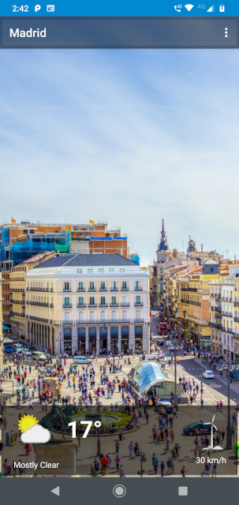
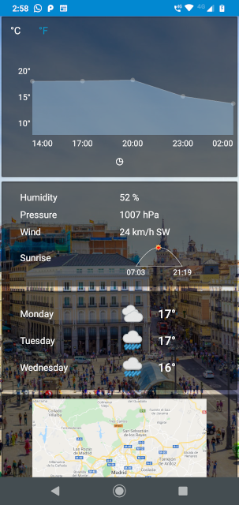

Sunshine with Architecture Components
================================

Weather application for Android devices

## About
This app is built with Android Architecture Components.

## Starting Classes

Below is a description of the different packages and classes in the starting app code:

### `data` package
Contains all classes related to local and network app data.

##### `data.network` package
All classes related to fetching data from the network.

* The network fetching and parsing functions are all written for you. Your job will be to fetch data at the right time and display the results. 
* You will not modify the `NetworkUtils`, `OpenWeatherJsonParser` and `WeatherResponse` classes.
* `WeatherNetworkDataSource` manages everything to do with the network. It's a singleton. It contains: 
* `scheduleRecurringFetchWeatherSync()` - Makes a repeating `JobService` using `FirebaseJobDispatcher`. This repeating job will eventually sync weather information in the background.
* `startFetchWeatherService()` - IntentService for doing an immediate fetch of weather data.
* `fetchWeather()` - Actually gets weather forecast data. This class uses the JSON parsing classes and network classes to make the fetch. It currently doesn't do anything with the fetched weather data.

##### `data.database` package
All classes related to caching the data locally (it's pretty empty right now).
* WeatherEntry - A simple Java object representing one day of weather.

### `ui` package
All activities and adapters - anything to do with display.

##### ui.detail package
* `DetailActivity` - Activity for a single day of forecast.
##### ui.list package
* `MainActivty` - Activity for a list of `WeatherEntry` forecasts.
* `ForecastAdapter` - `RecyclerView.Adapter` for displaying the list of `WeatherEntry` forecasts.

